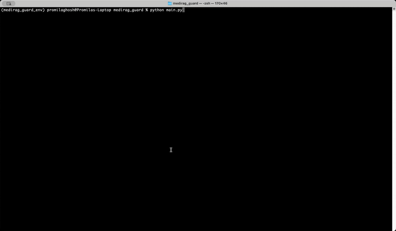

[](https://opensource.org/licenses/MIT)


# MediRAG Guard: Context-Aware Retrieval-Augmented Generation for Healthcare Data Privacy


**MediRAG Guard** is a specialized **R**etrieval-**A**ugmented **G**eneration (RAG) system engineered to deliver highly informed and contextually rich answers concerning healthcare data privacy. It enhances the capabilities of standard RAG by integrating a hierarchical knowledge map, which expands and enriches the context of retrieved information, leading to more comprehensive and accurate responses from a Large Language Model (LLM).

---

## Table of Contents

-   [Features](#features)
-   [Demo](#demo)
-   [Project Structure](#project-structure)
-   [Setup and Installation](#setup-and-installation)
-   [Usage](#usage)
-   [Configuration](#configuration)
-   [How it Works](#how-it-works)
-   [Customizing with Your Own Data and Context Tree](#customizing-with-your-own-data-and-context-tree)
-   [Contributing](#contributing)
-   [Limitations and Future Work](limitations)
-   [License](#license)

---

## Features

-   **Context Tree Integration:** Leverages a predefined hierarchical context tree to provide a deeper understanding of retrieved document chunks by associating them with broader conceptual relationships.
-   **ChromaDB Integration:** Utilizes ChromaDB as a robust, persistent vector store for efficient semantic retrieval of relevant healthcare data privacy documents.
-   **Groq LLM Integration:** Harnesses Groq's high-performance LLMs to generate coherent, accurate, and context-aware responses with impressive speed.
-   **Dynamic Prompt Generation:** Constructs sophisticated prompts that intelligently combine the original user query, the content of retrieved chunks, their associated metadata, and the newly derived hierarchical context.
-   **Out-of-Context Handling:** Incorporates explicit instructions for the LLM to gracefully acknowledge and address queries for which no direct relevant information is found within the provided context, ensuring transparent and helpful responses.
-   **Modular Design:** The codebase is meticulously organized into separate, logical files, promoting ease of maintenance, scalability, and reusability for future enhancements.

---

## Demo

Watch a short video demonstrating MediRAG Guard in action, showcasing its ability to retrieve context-aware answers on healthcare data privacy.

[The full demo video link](https://github.com/pr0mila/MediRag-Guard/blob/main/asset/demo.webm)




---

## Project Structure

```

medirag_guard/
├── config.py             # Configuration parameters (API keys, paths, model names, initial data)
├── data_ingestion.py     # Handles loading documents into ChromaDB
├── context_tree.py       # Defines the hierarchical context tree and related utility functions
├── rag_system.py         # Core RAG logic: retrieval, context expansion, prompt generation, LLM interaction
├── main.py               # Main entry point for running the demo and queries
├── .env                  # Environment variables (e.g., GROQ\_API\_KEY)
└── README.md             # This README file

````

---

## Setup and Installation

Follow these steps to get MediRAG Guard up and running on your local machine.

### 1. Clone the Repository

```bash
git clone https://github.com/pr0mila/MediRag-Guard.git
cd medirag_guard
````

### 2. Create a Conda Virtual Environment (Recommended)

```bash
conda create -n medirag_guard_env python=3.9
conda activate medirag_guard_env
```

*(You can choose a different Python version like `3.10` or `3.11` if preferred.)*

### 3\. Install Dependencies

Install the packages:

```
chromadb
langchain
langchain-groq
python-dotenv
sentence-transformers
```

Or, install all the required libraries into your active Conda environment using pip:

```bash
pip install -r requirements.txt
```

### 4. Configure Environment Variables

Create a `.env` file in the root directory of the project (`medirag_guard`) and add your Groq API key:

```
GROQ_API_KEY="your_groq_api_key_here"
# You can optionally specify a different Groq model name
GROQ_MODEL_NAME="llama-3.1-8b-instant"
```

Replace `"your_groq_api_key_here"` with your actual API key obtained from [Groq Console](https://console.groq.com/).

-----

## Usage

To run the MediRAG Guard demo and interact with the system:

1.  **Ensure all dependencies are installed** and the `.env` file is set up correctly.

2.  **Activate your Conda environment:**

    ```bash
    conda activate medirag_guard_env
    ```

3.  **Run the `main.py` script:**

    ```bash
    python main.py
    ```

The script will first ingest the sample documents into ChromaDB (if they don't already exist) and then proceed to ask a series of predefined queries. You'll see detailed output at each stage of the RAG pipeline: chunk retrieval, context expansion, prompt generation, and the final LLM response.

-----

## Configuration

All configurable parameters are centralized in `config.py`:

  - **`CHROMA_PERSIST_DIR`**: Specifies the directory where ChromaDB will store its persistent data, ensuring your vector database remains intact across sessions.
  - **`COLLECTION`**: Defines the name of the ChromaDB collection used to store document embeddings.
  - **`EMBEDDING_MODEL`**: Determines the sentence-transformer model utilized for generating document embeddings (default: `sentence-transformers/all-MiniLM-L6-v2`).
  - **`GROQ_API_KEY`**: Your essential Groq API key, securely loaded from the `.env` file for authenticating with Groq's services.
  - **`GROQ_MODEL_NAME`**: Designates the specific Groq model to employ for generating responses (e.g., `llama3-8b-8192`).
  - **`DOC_CHUNKS`**: A list of sample text chunks included for initial ingestion and demonstration purposes. In a production environment, this would be dynamically populated from your actual data sources.

-----

## How it Works

MediRAG Guard employs a sophisticated, multi-stage Retrieval-Augmented Generation process:

1.  **Document Ingestion (`data_ingestion.py`):**

      - Raw text chunks, containing critical information on healthcare data privacy, are meticulously transformed into `Langchain Document` objects.
      - Each document's content is hashed to serve as a unique identifier, crucial for its integration with the context tree.
      - These processed documents are then embedded into a dense vector space and efficiently stored in a persistent ChromaDB collection, enabling rapid semantic searches.

2.  **Context Tree Definition (`context_tree.py`):**

      - A predefined, static `CONTEXT_TREE` dictionary establishes a clear hierarchical structure of knowledge domains directly relevant to healthcare data privacy.
      - Crucially, the leaf nodes within this tree contain the SHA256 hashes of corresponding document chunks. This linkage ensures a robust connection between the semantic information stored in ChromaDB and its conceptual place within the defined knowledge hierarchy.

3.  **Retrieval-Augmented Generation (`rag_system.py`):**

      - Upon receiving a user query:
          - **Retrieval:** The system efficiently queries ChromaDB to pinpoint and retrieve the most semantically relevant document chunks based on the user's input.
          - **Context Expansion:** For each retrieved chunk, its precise location within the `CONTEXT_TREE` is identified. The system then intelligently traverses upwards from this leaf node to gather "broader context," which includes sibling nodes at various hierarchical levels. This process significantly enriches the retrieved information with its conceptual surroundings, providing a more holistic view.
          - **Prompt Generation:** A highly detailed and structured prompt is dynamically constructed for the LLM. This prompt meticulously integrates the original query, the full content of the retrieved chunks, any associated metadata, and the newly derived broader hierarchical context. Specific instructions are included to guide the LLM's response, especially on how to transparently handle scenarios where no direct relevant context is found.
          - **LLM Interaction:** The comprehensively generated prompt is then seamlessly sent to the configured Groq LLM, which processes the information and generates a precise answer.
          - **Response Truncation:** The LLM's raw output undergoes a final post-processing step to ensure the answer is gracefully truncated at the last complete sentence (identified by a full stop), enhancing overall readability and conciseness.

-----

## Customizing with Your Own Data and Context Tree

MediRAG Guard is designed to be adaptable to your specific knowledge domain. Here's how you can use your own document chunks and define a custom context tree:

1.  **Prepare Your Document Chunks:**

      * Gather your raw text data (e.g., articles, reports, internal documentation).
      * Break this data down into smaller, meaningful "document chunks." Each chunk should ideally represent a distinct piece of information or concept. Paragraphs or small sections often work well.
      * **Important:** Ensure your chunks are well-defined and focused to improve retrieval accuracy.

2.  **Update `config.py`:**

      * Open the `medirag_guard/config.py` file.
      * Locate the `DOC_CHUNKS` list.
      * Replace the existing sample chunks with your own prepared document chunks. Each item in the list should be a string containing the text of one chunk.

    <!-- end list -->

    ```python
    # Example in config.py
    DOC_CHUNKS = [
        "Your first custom document chunk text here.",
        "Your second custom document chunk text here.",
        # ... and so on for all your chunks
    ]
    ```

3.  **Design and Update `context_tree.py`:**

      * Open the `medirag_guard/context_tree.py` file.
      * **`CHUNK_HASHES` Dictionary:** This dictionary (which maps SHA256 hashes to chunk content) will be automatically updated when the script runs, based on the `DOC_CHUNKS` you provided in `config.py`. You don't need to manually edit this.
      * **`CONTEXT_TREE` Dictionary:** This is where you define your custom hierarchy.
          * Think about the logical structure of your information. What are the main categories and sub-categories?
          * Represent this structure as a nested Python dictionary.
          * The "leaf" nodes of this tree (the innermost values associated with keys) should be lists containing the **SHA256 hashes** of your document chunks.
          * To get the hash for a specific chunk from your `DOC_CHUNKS` list (e.g., the chunk at index `i`), you would use: `hashlib.sha256(DOC_CHUNKS[i].encode()).hexdigest()`.

    <!-- end list -->

    ```python
    # Example in context_tree.py
    import hashlib # Ensure hashlib is imported
    from config import DOC_CHUNKS # To access your chunks for hashing

    # CHUNK_HASHES will be auto-populated

    CONTEXT_TREE = {
        "Your Top Category 1": {
            "Your Sub-Category A": [
                hashlib.sha256(DOC_CHUNKS[0].encode()).hexdigest(), # Hash of your first chunk
                hashlib.sha256(DOC_CHUNKS[1].encode()).hexdigest()  # Hash of your second chunk
            ],
            "Your Sub-Category B": [
                hashlib.sha256(DOC_CHUNKS[2].encode()).hexdigest()
            ]
        },
        "Your Top Category 2": {
            "Another Sub-Category": [
                hashlib.sha256(DOC_CHUNKS[3].encode()).hexdigest()
            ],
            "Leaf Node Directly Under Top Category": [ # A list of hashes can also be a direct child
                 hashlib.sha256(DOC_CHUNKS[4].encode()).hexdigest()
            ]
        },
        # ... and so on for your entire custom hierarchy
    }
    ```

4.  **Run the Ingestion and System:**

      * After saving your changes to `config.py` and `context_tree.py`, run the `main.py` script as usual:
        ```bash
        python main.py
        ```
      * The `data_ingestion.py` script (called by `main.py`) will process your new `DOC_CHUNKS`, generate their embeddings, and store them in ChromaDB. If document IDs (hashes) already exist, they won't be re-added, but new ones will be.
      * The RAG system will then use your custom `CONTEXT_TREE` for context expansion when answering queries.

By following these steps, you can tailor MediRAG Guard to work effectively with your own specific datasets and knowledge structures.

-----
## Limitations and Future Work

MediRAG Guard, as a Proof of Concept, has some limitations that offer opportunities for future improvement:

* **Static Context Tree**: The current context tree is manually created from a small dataset. For larger applications, automating the generation and maintenance of this tree from bigger, dynamic knowledge bases is essential.
* **Data Scale & Diversity**: The POC uses a small set of healthcare documents. To scale to millions of diverse documents, we need better storage, retrieval, and chunking methods.
* **Production Readiness**: While it works, the POC is not ready for production due to lack of error handling, security, performance optimization, and live monitoring.
* **Complex Queries**: Handling vague, multi-step, or subjective queries is still challenging and requires more research to improve.
* **Cost Optimization**: The current system focuses on functionality over cost-efficiency. Scaling for long-term use will need cost-effective LLM inference and database solutions.

-----

## Contributing

Contributions to **MediRAG Guard** are highly encouraged and valued! If you have suggestions for new features, improvements, or wish to report any bugs, please feel free to open an issue or submit a pull request. Your contributions help make this project better for everyone.

-----

## License

This project is open-source and available under the [MIT License](https://www.google.com/search?q=LICENSE).
